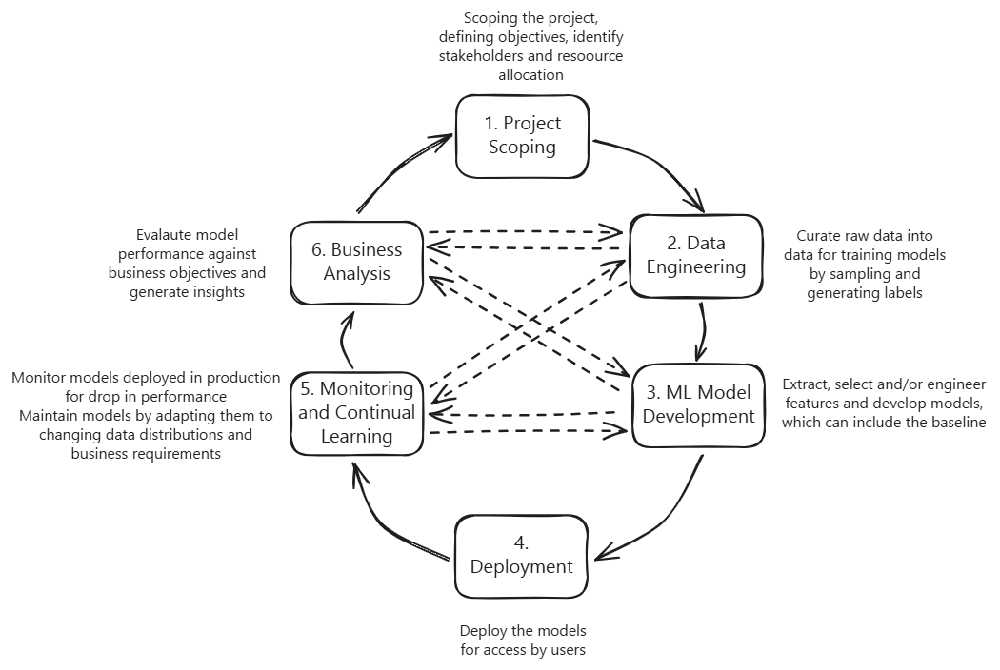

# Designing ML Systems

## Book Details

- **Author:** Chip Huyen
- **Domain:** Machine Learning, System Design

## Changelog

| Date           | Change Description        |
| -------------- | ------------------------- |
| April 20, 2026 | Added notes for Chapter 1 |
| April 21, 2026 | Added notes for Chapter 2 |

## Chapter-wise Notes

### Chapter 1 - Overview of Machine Learning Systems

ML systems consist of a variety of components:

- End users
- Business Requirements
- Data Stack
- Logic to train, deploy, monitor and maintain models
- Interface between the ML system and users
- Infrastructure to implement the logic to train, deploy, monitor and maintain

It is important to identify if the objective needs an ML solution or simpler solution will suffice. The solution needs ML if:

- The objective is to learn complex patterns from existing data so that predictions can be made for new data
  - The patterns to learn are complex to learn and can change over time, especially with rule-based solutions
  - Data can be collected for the model to learn patterns. Alternatively, zero-shot learning or continual learning could be applied in the absence of directly available data
  - Making predictions from learned patterns instead of exact measures can be very helpful, especially in complex and compute-intensive tasks
  - The patterns learned by the model can be assumed to be similar to those in the new unseen data
- The task (and hence the patterns) are repetitive
- The cost of incorrect predictions, on average, is worth the tradeoff of the benefits of correct predictions
- The solution is being applied to get a large number of predictions, which helps better utilization of large compute and memory provisioning, and collection of large amounts of data

ML in research vs production have different requirements

| Aspect                 | Research                                                                         | Production                                                                                                            |
| ---------------------- | -------------------------------------------------------------------------------- | --------------------------------------------------------------------------------------------------------------------- |
| Requirements           | Getting state-of-the-art (SOTA) results on benchmark datasets                    | Depends on the different stakeholders (ML Engineers, Product team, Data Analysts etc)                                 |
| Data                   | Typically clean and static data is used. Focus is exploring different algorithms | Data can be messy, imbalanced and can need lots of data cleaning and pre-processing                                   |
| Computational Priority | Focus is on fast training and high throughput                                    | Focus is on fast inference and low latency                                                                            |
| Fairness               | Not high in objectives (Focus is on achieving SOTA results)                      | Important in objectives since it can impact the results for different groups of end users                             |
| Interpretability       | Not high in objectives (Focus is on achieving SOTA results)                      | Important in objectives since model working and predictions must be explainable to developers, stakeholders and users |

Considerations to keep in mind when deploying ML models to production:

- Need methods for version control and testing of code, data and models
- Need effective measures to deploy models as they increase in size (number of parameters) at scale
- Need monitoring for changing data patterns, model performance - necessary for model observability and monitoring

### Chapter 2 - Introduction to Machine Learning System Design

In the industry, improving ML metrics alone is not enough to guarantee the success of a ML project. There must be an increase in business metrics (increase in revenue through direct or indirect reasons) which is possible due to the ML project's success

**Relationship between ML adoption maturity and returns on investment**

- The longer the ML solution is implemented or adopted, the greater the returns will be.
- Longer adoption = More efficient pipeline runs = Less engineering time = Fast development cycle = Lower cloud bills
- Initially, there will be a large investment in terms of capital, time and energy in collecting data, training and improving models etc, but the longer this cyclic process continues, the lesser the engineering costs become over time and the results also gradually improve over time if the data is modeled correctly.

**Main requirements of ML systems**

| Aspect                                              | Reliability                                                                                                                                     | Scalability                                                                                                                                                                                                                                                                                                                                                        | Maintainability                                                                                                                                                                           | Adaptability                                                                                                               |
| --------------------------------------------------- | ----------------------------------------------------------------------------------------------------------------------------------------------- | ------------------------------------------------------------------------------------------------------------------------------------------------------------------------------------------------------------------------------------------------------------------------------------------------------------------------------------------------------------------ | ----------------------------------------------------------------------------------------------------------------------------------------------------------------------------------------- | -------------------------------------------------------------------------------------------------------------------------- |
| **System Significance**                             | The system must provide the correct answer at required performance, even when there are hardware or software errors or even human errors        | The system should be able up-scale (expand resources needed) and down-scale(reduce resources needed) as and when required -> This becomes easy with the automatic scaling provided by cloud services  The system needs to be able to scale the monitoring, retraining, code generation etc. for data, models and other artifacts                             | Is the system implementation and infrastructure designed so that different team members like Data Scientists, ML Engineers, DevOps Engineers etc., can all work on the system seamlessly? | Can the system adapt to changing data distributions and business requirements?  This ties together with maintability |
| **Things to keep note of when building ML systems** | ML systems can fail silently. For example: The model can predict a wrong value, but the end user may use it without knowing it is wrong   | Scaling up for complexity (Move from simpler to more complex model with larger feature set and more complex pre-processing)  Scaling up in traffic volume (100,000 requests per day to 1 million requests every hour)  Scaling up in number of models (1 model for the sample use case to 100s of models where each model is for a dedicated customer) | Code should be well-documented  Models should be reproducible  Easy debugging of problems and solution implementation                                                         | Capacity for discovering performance improvement aspects and services upgrades without interruption                        |

**Iterative Process of developing ML systems**

**Source: Adapted from Chapter 2 in Designing ML Systems by Chip Huyen**

**Common ML task types**

- Regression
- Classification
  - Binary
  - Multiclass
  - Multilabel

**Framing ML problems and objective functions**

- When the ML problem is complex, it typically cannot be represented with a single objective function. There must be multiple decoupled objective functions for minimization.
- Decoupling multiple objectives makes ML model development and maintenance easier.
