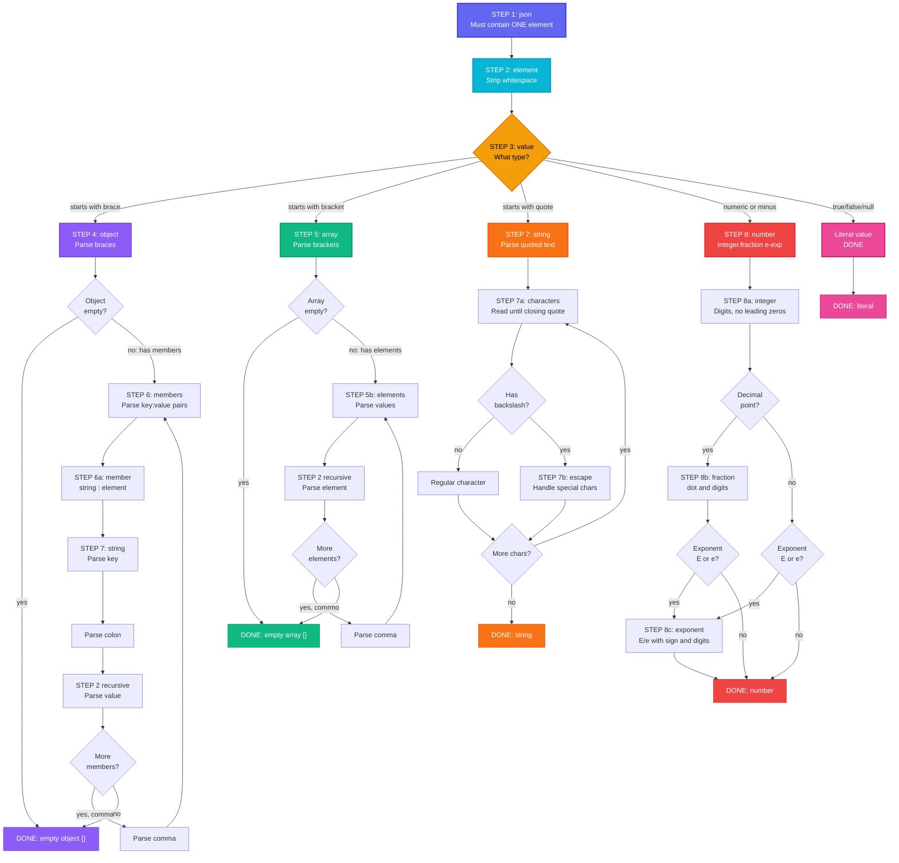

# JSON Grammar Rules

## Changelog

| Date         | Change Description                                       |
| ------------ | -------------------------------------------------------- |
| May 11, 2026 | Added notes about JSON grammar rules using McKeeman Form |

## JSON Grammer Rules in McKeeman Form

The following is the JSON grammar defined in the McKeeman Form[^1]

```
json
    element

value
    object
    array
    string
    number
    true
    false
    null

object
    '{' ws '}'
    '{' members '}'

members
    member
    member ',' members

member
    ws string ws ':' element

array
    '[' ws ']'
    '[' elements ']'

elements
    element
    element ',' elements

element
    ws value ws

string
    '"' characters '"'

characters
    ""
    character characters

character
    '0020' . '10FFFF' - '"' - '\'
    '\' escape

escape
    '"'
    '\'
    '/'
    'b'
    'f'
    'n'
    'r'
    't'
    'u' hex hex hex hex

hex
    digit
    'A' . 'F'
    'a' . 'f'

number
    integer fraction exponent

integer
    digit
        onenine digits
        '-' digit
        '-' onenine digits

digits
    digit
    digit digits

digit
    '0'
    onenine

onenine
    '1' . '9'

fraction
    ""
    '.' digits

exponent
    ""
    'E' sign digits
    'e' sign digits

sign
    ""
    '+'
    '-'

ws
    ""
    '0020' ws
    '000A' ws
    '000D' ws
    '0009' ws

```

## Understanding the Parsing Order (Top-Down Approach)

### Step 1: Start with JSON

**Rule:**

```
json
    element
```

**Meaning:** A JSON document is exactly ONE element.
**Example:**

```
{"name": "Alice"}        ← This is ONE element (an object)
[1, 2, 3]               ← This is ONE element (an array)
"hello"                 ← This is ONE element (a string)
42                      ← This is ONE element (a number)
true                    ← This is ONE element (a literal)
```

You cannot have:

```
{} []               ← Two elements (invalid JSON)
"a" "b"             ← Two elements (invalid JSON)
```

### Step 2: Parse an Element (Allow Whitespace Around It)

**Rule:**

```
element
 ws value ws
```

**Meaning:** An element is: `[optional whitespace] + [a value] + [optional whitespace]`
Whitespace can be Spaces, Newlines, Tabs, Carriage returns, or nothing at all

**Examples:**

```
{"name":"Alice"}     ← No whitespace
{ "name" : "Alice" } ← Whitespace around everything
{
  "name": "Alice"
}                    ← Newlines and indentation (also whitespace)
   42   ← Whitespace before and after
```

All of these are valid because whitespace is stripped away in the grammar rules.

### Step 3: Determine What Type of Value You Have

**Rule:**

```
value
    object
    array
    string
    number
    "true"
    "false"
    "null"
```

**Meaning:** A value can be ONE of these six things:

- object — starts with `{`
- array — starts with `[`
- string — starts with `"`
- number — starts with a digit, minus sign, or decimal
- true — the literal word true
- false — the literal word false
- null — the literal word null

**Examples:**

```
{} ← Value is an object
[] ← Value is an array
"hello" ← Value is a string
42 ← Value is a number
3.14 ← Value is a number
-5 ← Value is a number
true ← Value is the literal true
false ← Value is the literal false
null ← Value is the literal null
```

**Decision Tree:**

- Does it start with `{`? → Follow the OBJECT rules (Step 4)
- Does it start with `[`? → Follow the ARRAY rules (Step 5)
- Does it start with `"`? → Follow the STRING rules (Step 7)
- Is it a number? → Follow the NUMBER rules (Step 8)
- Is it true, false, or null? → Done! It's a literal

### BRANCH A: OBJECTS

#### Step 4: Parse an Object

**Rules:**

```
object
    '{' ws '}'
    '{' members '}'
```

**Meaning:** An object is either:

- An opening brace `{`, `optional whitespace`, and a closing brace `}` — **Empty Object**
- An opening brace `{`, one or more members, and a closing brace `}` — **Object with Data**

**Examples:**

```
{}                              ← Empty object

{ "name": "Alice" }             ← Object with 1 member

{ "name": "Alice", "age": 30 }  ← Object with 2 members

{
  "name": "Alice",
  "age": 30,
  "city": "NYC"
}                               ← Object with 3 members (formatted)
```

If the object is NOT empty, follow to Step 6 for members.

#### Step 6: Parse Members (Key-Value Pairs)

**Rules:**

```
members
    member
    member ',' members
```

**Meaning:** Members are either:

- A single member
- A member, then a comma, then more members (recursive)

This means:

```
One member: "name": "Alice"
Two members: "name": "Alice", "age": 30
Many members: chain them with commas
```

Each member is:

```
member
    ws string ws ':' element
```

**Meaning:**

- Optional whitespace (ws)
- A string (the key name)
- Optional whitespace (ws)
- A colon :
- An element (the value)

**Examples:**

```
"name": "Alice"
↓
ws + string "name" + ws + ':' + element "Alice"

"age": 30
↓
ws + string "age" + ws + ':' + element 30

"hobbies": ["reading", "coding"]
↓
ws + string "hobbies" + ws + ':' + element [array]
```

For the string part, follow Step 7.
For the element part, recursively follow [Step 2](#step-2-parse-an-element-allow-whitespace-around-it) (which leads back to [Step 3](#step-3-determine-what-type-of-value-you-have)).

### BRANCH B: ARRAYS

#### Step 5: Parse an Array

**Rules:**

```
array
    '[' ws ']'
    '[' elements ']'
```

**Meaning:** An array is either:

- An opening bracket `[`, `optional whitespace`, and a closing bracket `]` — Empty Array
- An opening bracket `[`, one or more elements, and a closing bracket `]` — Array with Data

**Examples:**

```
[]                         ← Empty array

[ 1, 2, 3 ]               ← Array with 3 numbers

[ "a", "b", "c" ]         ← Array with 3 strings

[ 1, "hello", true ]      ← Array with mixed types

[
  { "name": "Alice" },
  { "name": "Bob" }
]                         ← Array with 2 objects (formatted)
```

If the array is NOT empty, follow to the next rule for elements.

**Elements Rule:**

```
elements
    element
    element ',' elements
```

**Meaning:** Elements are either:

- A single element
- An element, then a comma, then more elements (recursive)

**Examples:**

```
1, 2, 3
↓
element 1 + ',' + elements(2, 3)

"a", "b", "c"
↓
element "a" + ',' + elements("b", "c")
```

For each element, recursively follow [Step 2](#step-2-parse-an-element-allow-whitespace-around-it) (which leads back to [Step 3](#step-3-determine-what-type-of-value-you-have)).

### BRANCH C: STRINGS

#### Step 7: Parse a String

**Rule:**

```
string
    '"' characters '"'
```

**Meaning:** A string is:

- An opening double quote `"`
- Zero or more characters (the content)
- A closing double quote `"`

**Characters Rule:**

```
characters
    ""
    character characters
```

**Meaning:** Characters can be:

- Empty (empty string is allowed)
- A single character followed by more characters (recursive)

**Examples:**

```
""              ← Empty string (zero characters)

"hello"         ← String with 5 characters: h, e, l, l, o

"Alice"         ← String with 5 characters: A, l, i, c, e

"Hello, World!" ← String with 13 characters including space, comma, punctuation
```

**Character Rule:**

```
character
    '0020' . '10FFFF' - '"' - '\' '\' escape
```

**Meaning:** A character can be:

- Any Unicode character from `U+0020` (space) to `U+10FFFF` (max Unicode)
  - EXCEPT the double quote `"` (because that ends the string)
  - EXCEPT the backslash `\` (because that starts escape sequences)
  - OR a backslash `\` followed by an escape sequence

**Escape Sequences Rule:**

```
escape
    '"' '\' '/' 'b' 'f' 'n' 'r' 't' 'u' hex hex hex hex
```

Meaning: After a backslash, you can use:

- `\"` — A literal double quote character
- `\\` — A literal backslash character
- `\/` — A literal forward slash (optional escaping)
- `\b` — Backspace character
- `\f` — Form feed character
- `\n` — Newline character
- `\r` — Carriage return character
- `\t` — Tab character
- `\u` followed by 4 hex digits — Unicode character by code point

**Examples:**

```
"Hello"             ← Plain text (no escapes)

"Hello \"World\""   ← Contains: Hello "World"
                      (quotes must be escaped)

"Path: C:\\Users"   ← Contains: Path: C:\Users
                      (backslash must be escaped)

"Line1\nLine2"      ← Contains a newline in the middle
                      Renders as:
                      Line1
                      Line2

"Copyright \u00A9"  ← \u00A9 is Unicode for ©
                      Renders as: Copyright ©

"Quote: \"Hi\""     ← Contains: Quote: "Hi"
```

### BRANCH D: NUMBERS

#### Step 8: Parse a Number

**Rule:**

```
number
    integer fraction exponent
```

**Meaning:** A number has three optional parts (all can be omitted or present):

- integer — required (at least the digits part)
- fraction — optional (decimal part)
- exponent — optional (scientific notation)

##### Part 1: Integer (Mandatory)

**Rules:**

```
integer
    digit
        onenine digits
        '-' digit
        '-' onenine digits
```

**Meaning:** An integer is either:

- A single digit (0-9)
- A number from 1-9, followed by zero or more digits, optionally preceded by a minus sign
- OR a minus sign, followed by a digit, OR a minus sign followed by 1-9 and more digits

Key point: No Leading Zeros (except for 0 itself)

**Examples:**

```
0 ← Single digit
5 ← Single digit
42 ← Two digits (no leading zero)
-1 ← Negative single digit
-42 ← Negative number
```

**Invalid Examples:**

```
01 ← Leading zero (not allowed)
-01 ← Leading zero (not allowed)
007 ← Leading zero (not allowed)
```

##### Part 2: Fraction (Optional)

**Rule:**

```
fraction
    ""
    '.' digits
```

**Meaning:** Fraction can be:

- Empty (nothing)
- A decimal point . followed by one or more digits

**Examples:**

```
42 ← No fraction part
42.5 ← Fraction: .5
3.14159 ← Fraction: .14159
0.001 ← Fraction: .001
```

Invalid Examples:

```
42. ← Period with no digits
.5 ← No digits before period
```

##### Part 3: Exponent (Optional)

**Rule:**

```
exponent
    ""
    'E' sign digits
    'e' sign digits
```

**Meaning:** Exponent can be:

- Empty (nothing)
- An uppercase `E`, optional sign, and digits
- A lowercase `e`, optional sign, and digits

**Sign Rule:**

```
sign
    ""
    '+' '-'
```

**Meaning:** Sign can be empty, a plus +, or a minus -.

**Examples:**

```
42 ← No exponent
42E10 ← Exponent: E10 (42 × 10^10)
42e-5 ← Exponent: e-5 (42 × 10^-5)
1.5E+3 ← Exponent: E+3 (1.5 × 10^3)
3.14e0 ← Exponent: e0 (3.14 × 10^0)
```

#### Step 9: Whitespace Rules (ws)

**Rule:**

```
ws
 ""
 '0020' ws
 '000A' ws
 '000D' ws
 '0009' ws
```

**Meaning:** Whitespace (ws) can be:

- Empty (nothing)
- A space character (`U+0020`) followed by more whitespace
- A newline character (`U+000A`) followed by more whitespace
- A carriage return character (`U+000D`) followed by more whitespace
- A tab character (`U+0009`) followed by more whitespace

This is recursive, meaning you can have any combination of these.

**Examples:**

```
(no space)              ← Empty ws
 (single space)
  (two spaces)
	(tab)
(newline)
(carriage return)

    (4 spaces)         ← Indentation
  	  (spaces and tabs mixed)
```

Where whitespace appears in JSON:

```
{ "name" : "Alice" }
↓
{}  = braces must be together
 ws = space before "name"
    ws = space after "name"
       ws = space before :
         ws = space after :
                    ws = space after "Alice"
                      ws = space before }

[1, 2, 3]
↓
[]  = brackets must be together
 ws = after [
    ws = after 1
       ws = after ,
         ws = after 2
            ws = after ,
              ws = after 3
                 ws = before ]
```

## Flowchart Summary of Parsing JSON



[^1]: D. Crockford, “McKeeman Form,” Crockford.com, Jan. 9, 2020. \[Online\]. Available: https://www.crockford.com/mckeeman.html. \[Accessed: 11-May-2026\].
