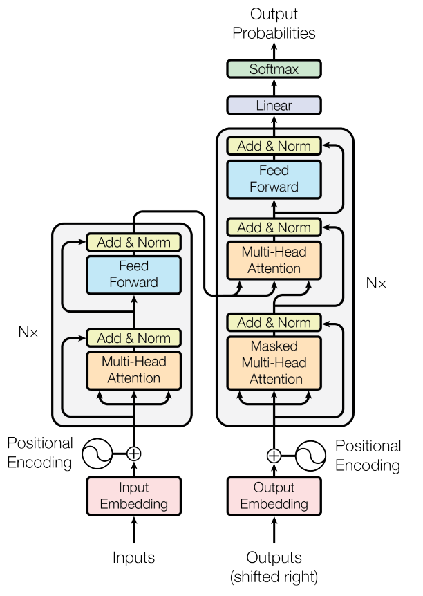

# Transformer Model Architecture

## Introduction

Transformers were first introduced in the landmark paper _Attention Is All You Need_ by Vaswani et al. in 2017. Unlike previous sequence models such as RNNs and LSTMs, Transformers rely entirely on the **attention mechanism** to process sequential information. This removes the need for recurrence, enabling highly parallel computation during training and allowing models to capture long-range dependencies much more effectively.

Today, nearly every state-of-the-art language model—including GPT, BERT, Llama, and Gemini—is built upon the Transformer architecture or one of its variants.

Below is the original architecture proposed in the paper.



The full architecture is made of two stacks:

- The **Encoder** (covered in Part 1) reads the full input sentence and builds a rich contextual representation of it.
- The **Decoder** (covered in Part 2) generates the output sequence one token at a time, using both what it has generated so far **and** the encoder's representation of the source sentence.

---

---

## Part 1 — Encoder

### Input and Input Embedding

A Transformer cannot directly process raw text. The input sentence must first be converted into a numerical representation.

Consider the sentence:

```text
"The cat sat on the mat"

```

The processing pipeline looks like:

```text
Text
 ↓
Tokenization
 ↓
Token IDs
 ↓
Embedding Layer
 ↓
Embedding Vectors

```

#### Tokenization

The sentence is split into smaller units called **tokens**.

```text
["The", "cat", "sat", "on", "the", "mat"]

```

Each token is mapped to an integer using a vocabulary. Note that the examples given are random numbers.

| Token | Token ID |
| ----- | -------- |
| The   | 125      |
| cat   | 845      |
| sat   | 412      |
| on    | 96       |
| the   | 56       |
| mat   | 761      |

This produces a vector of token IDs:

$$X_{ids} = [125, 845, 412, 96, 56, 761]$$

For a sequence length $L = 6$, the token ID tensor has shape:

$$(L)$$

Or with batching:

$$(B, L)$$

Where:

- $B$ = batch size (number of sequences processed in parallel)
- $L$ = sequence length (number of tokens in the sequence)

---

#### Embedding Layer

Integer IDs carry no semantic information. For example:

```text
cat = 845
dog = 432

```

This does **not** imply that "cat" is twice as similar to "dog" as another word.

Instead, each token ID indexes into a learnable embedding matrix $E$:

$$E \in \mathbb{R}^{V \times d_{model}}$$

**Understanding the Matrix Dimensions ($V \times d_{model}$):**

- **Rows ($V$):** Each row corresponds to a specific vocabulary token ID (from ID `0` to `V-1`).
- **Columns ($d_{model}$):** Each column represents a learned continuous feature/dimension.

##### Visual Example of Vocabulary Embedding Matrix $E$ ($V \times d_{model}$):

$$
\begin{matrix}
& \text{dim}_1 & \text{dim}_2 & \dots & \text{dim}_{d_{model}} \\
\text{ID } 0 \\
\vdots \\
\mathbf{\text{ID } 56 \text{ ("the")}} \\
\vdots \\
\mathbf{\text{ID } 125 \text{ ("The")}} \\
\vdots \\
\mathbf{\text{ID } 845 \text{ ("cat")}} \\
\vdots \\
\text{ID } V-1
\end{matrix}
\quad
E = \begin{bmatrix}
0.01 & -0.12 & \dots & 0.05 \\
\vdots & \vdots & \ddots & \vdots \\
0.11 & -0.65 & \dots & 0.02 \\
\vdots & \vdots & \ddots & \vdots \\
\mathbf{0.14} & \mathbf{-0.73} & \mathbf{\dots} & \mathbf{0.08} \\
\vdots & \vdots & \ddots & \vdots \\
\mathbf{1.82} & \mathbf{0.51} & \mathbf{\dots} & \mathbf{-0.44} \\
\vdots & \vdots & \ddots & \vdots \\
-0.08 & 0.33 & \dots & 0.19
\end{bmatrix}
$$

Given token IDs $X_{ids} \in \mathbb{R}^{L}$, the lookup extracts the row for each token ID to form the input representation matrix $X$:

$$X = E[X_{ids}] \in \mathbb{R}^{L \times d_{model}}$$

##### Visual Example of Input Embedding Matrix $X$ ($L \times d_{model}$):

$$
\begin{matrix}
& \text{dim}_1 & \text{dim}_2 & \dots & \text{dim}_{d_{model}} \\
\text{Token 0 ("The")} \\
\text{Token 1 ("cat")} \\
\text{Token 2 ("sat")} \\
\text{Token 3 ("on")} \\
\text{Token 4 ("the")} \\
\text{Token 5 ("mat")}
\end{matrix}
\quad
X = \begin{bmatrix}
0.14 & -0.73 & \dots & 0.08 \\
1.82 & 0.51 & \dots & -0.44 \\
-0.62 & 1.03 & \dots & 0.27 \\
0.04 & -0.11 & \dots & 0.91 \\
0.11 & -0.65 & \dots & 0.02 \\
1.45 & 0.38 & \dots & -0.21
\end{bmatrix}
$$

- **Rows ($L = 6$):** Each row represents a word/token in our sentence.
- **Columns ($d_{model} = 512$):** Dense vector features representing word semantics.

---

#### Why Embeddings?

Neural networks operate on continuous values. Embeddings allow words with similar meanings to have similar vector representations.

For example, words like `cat`, `dog`, `lion`, and `tiger` may occupy nearby regions in vector space, whereas `cat`, `airplane`, `economics`, and `banana` are much farther apart.

---

### Position Encoding (Input)

Unlike RNNs, Transformers process all tokens **simultaneously**.

Without any notion of position, the Transformer would process "Dog bites man" and "Man bites dog" identically. Therefore, we must inject positional information.

---

#### Why Position Encoding?

Attention itself is **permutation equivariant** (and the overall set-based operation is permutation invariant).

Without position encodings, if you permute (shuffle) the rows of the input matrix $X$, the self-attention output rows will be permuted in the exact same order, carrying no inherent concept of word order or distance.

---

#### Mathematical Proof of Permutation Equivariance

Let $X \in \mathbb{R}^{L \times d_{model}}$ be the input matrix, and $W_Q, W_K, W_V$ be the projection weight matrices.

The standard Self-Attention formula is:

$$\text{Attention}(X) = \text{Softmax}\left(\frac{(X W_Q)(X W_K)^T}{\sqrt{d_k}}\right) (X W_V)$$

Apply a permutation matrix $P \in \mathbb{R}^{L \times L}$ to shuffle the order of tokens in $X$. A permutation matrix is an orthogonal matrix where $P^T P = P P^T = I$.

Let the permuted input be $X_{\text{perm}} = P X$.

1. **Permuted Projections:**

$$Q_{\text{perm}} = P X W_Q = P Q$$

$$K_{\text{perm}} = P X W_K = P K$$

$$V_{\text{perm}} = P X W_V = P V$$

2. **Permuted Attention Scores:**

$$Q_{\text{perm}} K_{\text{perm}}^T = (P Q) (P K)^T = P Q (K^T P^T) = P (Q K^T) P^T$$

3. **Applying Softmax:**
   Since Softmax operates row-wise, multiplying by $P$ on the left reorders the rows, and multiplying by $P^T$ on the right reorders the columns:

$$\text{Softmax}\left(\frac{P (Q K^T) P^T}{\sqrt{d_k}}\right) = P \cdot \text{Softmax}\left(\frac{Q K^T}{\sqrt{d_k}}\right) \cdot P^T$$

4. **Multiplying by Permuted Values $V_{\text{perm}}$:**

$$\text{Attention}(X_{\text{perm}}) = \left[ P \cdot \text{Softmax}\left(\frac{Q K^T}{\sqrt{d_k}}\right) P^T \right] (P V)$$

Since $P^T P = I$:

$$\text{Attention}(X_{\text{perm}}) = P \cdot \text{Softmax}\left(\frac{Q K^T}{\sqrt{d_k}}\right) V = P \cdot \text{Attention}(X)$$

$$\boxed{\text{Attention}(P X) = P \cdot \text{Attention}(X)}$$

**Conclusion:** Permuting the input sequence by $P$ simply permutes the output sequence by $P$. The operation has no intrinsic preference for sequence order, which is why positional encodings must be explicitly added.

---

#### Sinusoidal Position Encoding

The original paper introduced fixed sinusoidal encodings. For position $pos$ and embedding dimension $i$:

$$PE(pos, 2i) = \sin\left(\frac{pos}{10000^{2i / d_{model}}}\right)$$

$$PE(pos, 2i+1) = \cos\left(\frac{pos}{10000^{2i / d_{model}}}\right)$$

##### Visual Example of Position Encoding Matrix $PE$ ($L \times d_{model}$):

$$
\begin{matrix}
& \text{dim}_0 (\sin) & \text{dim}_1 (\cos) & \text{dim}_2 (\sin) & \dots & \text{dim}_{d_{model}-1} (\cos) \\
\text{Pos 0} \\
\text{Pos 1} \\
\text{Pos 2} \\
\text{Pos 3} \\
\text{Pos 4} \\
\text{Pos 5}
\end{matrix}
\quad
PE = \begin{bmatrix}
0.000 & 1.000 & 0.000 & \dots & 1.000 \\
0.841 & 0.540 & 0.010 & \dots & 0.999 \\
0.909 & -0.416 & 0.020 & \dots & 0.999 \\
0.141 & -0.990 & 0.030 & \dots & 0.999 \\
-0.757 & -0.654 & 0.040 & \dots & 0.999 \\
-0.959 & 0.284 & 0.050 & \dots & 0.998
\end{bmatrix}
$$

---

#### Adding Position Information

We perform element-wise addition of the input embedding $X$ and position encoding $PE$:

$$X' = X + PE$$

##### Visual Example of Final Encoder Input Matrix $X'$ ($L \times d_{model}$):

$$
\begin{matrix}
& \text{dim}_1 & \text{dim}_2 & \dots & \text{dim}_{d_{model}} \\
\text{"The" (Pos 0)} \\
\text{"cat" (Pos 1)} \\
\text{"sat" (Pos 2)} \\
\text{"on" (Pos 3)} \\
\text{"the" (Pos 4)} \\
\text{"mat" (Pos 5)}
\end{matrix}
\quad
X' = \begin{bmatrix}
0.14 & 0.27 & \dots & 1.08 \\
2.66 & 1.05 & \dots & 0.559 \\
0.289 & 0.614 & \dots & 1.269 \\
0.181 & -1.100 & \dots & 1.909 \\
-0.647 & -1.304 & \dots & 1.019 \\
0.491 & 0.664 & \dots & 0.788
\end{bmatrix}
$$

---

### Encoder Block

Each encoder block consists of:

1. Multi-Head Self-Attention
2. Add & Layer Normalization
3. Position-wise Feed-Forward Network
4. Add & Layer Normalization

---

#### Query, Key, and Value

The positional input $X'$ is projected into Query ($Q$), Key ($K$), and Value ($V$) matrices using learnable weight parameters $W_Q, W_K, W_V$.

Let $d_k = d_v = 64$ for a single attention head.

##### Weight Matrix $W_Q \in \mathbb{R}^{d_{model} \times d_k}$ ($512 \times 64$):

- **Rows ($d_{model} = 512$):** Maps each feature of the input embedding.
- **Columns ($d_k = 64$):** Projects into the smaller query subspace.

$$
\begin{matrix}
& \text{q\_dim}_1 & \text{q\_dim}_2 & \dots & \text{q\_dim}_{64} \\
\text{in\_dim}_1 \\
\text{in\_dim}_2 \\
\vdots \\
\text{in\_dim}_{512}
\end{matrix}
\quad
W_Q = \begin{bmatrix}
0.02 & -0.15 & \dots & 0.08 \\
-0.41 & 0.22 & \dots & -0.03 \\
\vdots & \vdots & \ddots & \vdots \\
0.17 & 0.09 & \dots & -0.31
\end{bmatrix}
$$

---

##### Computation of $Q$, $K$, and $V$:

$$Q = X' W_Q \in \mathbb{R}^{L \times d_k} \quad (6 \times 64)$$

$$K = X' W_K \in \mathbb{R}^{L \times d_k} \quad (6 \times 64)$$

$$V = X' W_V \in \mathbb{R}^{L \times d_v} \quad (6 \times 64)$$

##### Visual Example of Query Matrix $Q$ ($L \times d_k$):

$$
\begin{matrix}
& \text{q\_dim}_1 & \text{q\_dim}_2 & \dots & \text{q\_dim}_{64} \\
\text{"The"} \\
\text{"cat"} \\
\text{"sat"} \\
\text{"on"} \\
\text{"the"} \\
\text{"mat"}
\end{matrix}
\quad
Q = \begin{bmatrix}
0.31 & -0.88 & \dots & 0.12 \\
1.42 & 0.25 & \dots & -0.91 \\
-0.15 & 0.77 & \dots & 0.43 \\
0.02 & -0.04 & \dots & 0.18 \\
0.29 & -0.81 & \dots & 0.09 \\
1.11 & 0.19 & \dots & -0.65
\end{bmatrix}
$$

##### Visual Example of Key Matrix $K$ ($L \times d_k$):

$$
\begin{matrix}
& \text{k\_dim}_1 & \text{k\_dim}_2 & \dots & \text{k\_dim}_{64} \\
\text{"The"} \\
\text{"cat"} \\
\text{"sat"} \\
\text{"on"} \\
\text{"the"} \\
\text{"mat"}
\end{matrix}
\quad
K = \begin{bmatrix}
0.05 & -0.12 & \dots & 0.54 \\
1.31 & 0.62 & \dots & -0.22 \\
-0.44 & 0.91 & \dots & 0.11 \\
0.10 & -0.01 & \dots & 0.03 \\
0.08 & -0.15 & \dots & 0.49 \\
0.98 & 0.45 & \dots & -0.18
\end{bmatrix}
$$

##### Visual Example of Value Matrix $V$ ($L \times d_v$):

Each row represents the **value vector** (content payload) of that word to be extracted during attention weighting.

$$
\begin{matrix}
& \text{v\_dim}_1 & \text{v\_dim}_2 & \dots & \text{v\_dim}_{64} \\
\text{Token 0 ("The")} \\
\text{Token 1 ("cat")} \\
\text{Token 2 ("sat")} \\
\text{Token 3 ("on")} \\
\text{Token 4 ("the")} \\
\text{Token 5 ("mat")}
\end{matrix}
\quad
V = \begin{bmatrix}
0.12 & 0.45 & \dots & -0.01 \\
\mathbf{2.10} & \mathbf{-1.30} & \mathbf{\dots} & \mathbf{0.85} \\
0.78 & 0.11 & \dots & -0.42 \\
0.01 & 0.05 & \dots & 0.02 \\
0.10 & 0.41 & \dots & -0.03 \\
1.65 & -0.95 & \dots & 0.60
\end{bmatrix}
$$

---

#### Scaled Dot-Product Attention

##### 1. Raw Attention Score Matrix $QK^T$ ($L \times L$):

Multiplying Query ($6 \times 64$) by Transposed Key ($64 \times 6$) yields dot-product similarities between all pairs of tokens.

$$
\begin{matrix}
& \text{"The"} & \text{"cat"} & \text{"sat"} & \text{"on"} & \text{"the"} & \text{"mat"} \\
\text{"The"} \\
\text{"cat"} \\
\text{"sat"} \\
\text{"on"} \\
\text{"the"} \\
\text{"mat"}
\end{matrix}
\quad
QK^T = \begin{bmatrix}
2.4 & 1.1 & 0.3 & 0.1 & 2.2 & 0.8 \\
0.9 & \mathbf{18.4} & 4.2 & 0.2 & 0.8 & \mathbf{12.1} \\
0.2 & 3.8 & 8.9 & 1.5 & 0.3 & 3.1 \\
0.1 & 0.3 & 1.2 & 1.8 & 0.1 & 0.4 \\
2.1 & 0.9 & 0.4 & 0.1 & 2.5 & 0.7 \\
0.7 & \mathbf{11.5} & 3.0 & 0.5 & 0.6 & \mathbf{14.2}
\end{bmatrix}
$$

- **Row $i$:** Token paying attention.
- **Column $j$:** Token being attended to.

---

##### 2. Scaling and Softmax Matrix $A = \text{Softmax}\left(\frac{QK^T}{\sqrt{d_k}}\right)$ ($L \times L$):

Divide by $\sqrt{64} = 8$ and apply Softmax row-wise so each row sums to $1.0$:

$$
\begin{matrix}
& \text{"The"} & \text{"cat"} & \text{"sat"} & \text{"on"} & \text{"the"} & \text{"mat"} & \text{\mathbf{Row Sum}} \\
\text{"The"} \\
\text{"cat"} \\
\text{"sat"} \\
\text{"on"} \\
\text{"the"} \\
\text{"mat"}
\end{matrix}
\quad
A = \begin{bmatrix}
0.31 & 0.15 & 0.08 & 0.06 & 0.28 & 0.12 \\
0.01 & \mathbf{0.68} & 0.04 & 0.01 & 0.01 & \mathbf{0.25} \\
0.03 & 0.22 & \mathbf{0.55} & 0.08 & 0.03 & 0.09 \\
0.11 & 0.14 & 0.22 & \mathbf{0.38} & 0.10 & 0.05 \\
0.27 & 0.12 & 0.07 & 0.05 & \mathbf{0.38} & 0.11 \\
0.01 & \mathbf{0.28} & 0.05 & 0.01 & 0.01 & \mathbf{0.64}
\end{bmatrix}
\begin{matrix}
(1.0) \\
(1.0) \\
(1.0) \\
(1.0) \\
(1.0) \\
(1.0)
\end{matrix}
$$

_Interpretation:_ In Row 1 ("cat"), the model places **68% attention** on itself ("cat") and **25% attention** on "mat".

---

##### 3. Attention Output Matrix $\text{Attention}(Q,K,V) = A V$ ($L \times d_v$):

Multiply Softmax probabilities ($6 \times 6$) by Values ($6 \times 64$):

$$
\begin{matrix}
& \text{v\_dim}_1 & \text{v\_dim}_2 & \dots & \text{v\_dim}_{64} \\
\text{"The"} \\
\text{"cat"} \\
\text{"sat"} \\
\text{"on"} \\
\text{"the"} \\
\text{"mat"}
\end{matrix}
\quad
\text{Output} = \begin{bmatrix}
0.41 & 0.18 & \dots & -0.08 \\
\mathbf{1.88} & \mathbf{-1.11} & \mathbf{\dots} & \mathbf{0.71} \\
0.62 & 0.04 & \dots & -0.28 \\
0.18 & 0.08 & \dots & 0.01 \\
0.38 & 0.22 & \dots & -0.05 \\
1.49 & -0.81 & \dots & 0.52
\end{bmatrix}
$$

Each row is a weighted sum of all value vectors in the sentence, encoding context.

---

### Multiple Heads

With $h = 8$ heads, each head generates an output matrix of size $(L \times d_v) = (6 \times 64)$.

$$\text{head}_1 = \begin{bmatrix} \dots \end{bmatrix}_{6 \times 64}, \quad \text{head}_2 = \begin{bmatrix} \dots \end{bmatrix}_{6 \times 64}, \quad \dots \quad \text{head}_8 = \begin{bmatrix} \dots \end{bmatrix}_{6 \times 64}$$

---

### Concatenation

Concatenating 8 heads side-by-side along columns produces a single wide matrix ($L \times h\cdot d_v$):

$$\text{Concat}(\text{head}_1, \dots, \text{head}_8) \in \mathbb{R}^{6 \times 512}$$

##### Visual Example of Concatenated Heads Matrix ($L \times 512$):

$$
\begin{matrix}
& \overbrace{\text{col}_0 \dots \text{col}_{63}}^{\text{Head 1}} & \overbrace{\text{col}_{64} \dots \text{col}_{127}}^{\text{Head 2}} & \dots & \overbrace{\text{col}_{448} \dots \text{col}_{511}}^{\text{Head 8}} \\
\text{"The"} \\
\text{"cat"} \\
\text{"sat"} \\
\text{"on"} \\
\text{"the"} \\
\text{"mat"}
\end{matrix}
\quad
\text{Concat} = \begin{bmatrix}
\begin{array}{c|c|c|c}
0.41 \dots -0.08 & -0.12 \dots 0.55 & \dots & 0.09 \dots -0.31 \\
1.88 \dots 0.71 & 0.94 \dots -0.11 & \dots & 1.15 \dots 0.42 \\
0.62 \dots -0.28 & 1.05 \dots 0.02 & \dots & -0.44 \dots 0.18 \\
0.18 \dots 0.01 & -0.03 \dots -0.12 & \dots & 0.01 \dots 0.05 \\
0.38 \dots -0.05 & -0.10 \dots 0.48 & \dots & 0.05 \dots -0.28 \\
1.49 \dots 0.52 & 0.81 \dots -0.04 & \dots & 1.02 \dots 0.33
\end{array}
\end{bmatrix}
$$

---

### Final Linear Projection

The output projection weight matrix $W_O \in \mathbb{R}^{512 \times 512}$ mixes features across all heads.

##### Visual Example of Output Weight Matrix $W_O$ ($512 \times 512$):

$$
\begin{matrix}
& \text{out\_dim}_1 & \text{out\_dim}_2 & \dots & \text{out\_dim}_{512} \\
\text{head\_feat}_1 \\
\text{head\_feat}_2 \\
\vdots \\
\text{head\_feat}_{512}
\end{matrix}
\quad
W_O = \begin{bmatrix}
0.11 & -0.04 & \dots & 0.25 \\
0.08 & 0.19 & \dots & -0.12 \\
\vdots & \vdots & \ddots & \vdots \\
-0.15 & 0.02 & \dots & 0.07
\end{bmatrix}
$$

##### Final Output Computation:

$$\text{MultiHead}(Q, K, V) = \text{Concat}(\text{head}_1, \dots, \text{head}_8) W_O \in \mathbb{R}^{6 \times 512}$$

##### Visual Example of Final Multi-Head Attention Matrix Output ($L \times d_{model}$):

$$
\begin{matrix}
& \text{dim}_1 & \text{dim}_2 & \dots & \text{dim}_{512} \\
\text{"The"} \\
\text{"cat"} \\
\text{"sat"} \\
\text{"on"} \\
\text{"the"} \\
\text{"mat"}
\end{matrix}
\quad
\text{Final Output} = \begin{bmatrix}
0.22 & -0.41 & \dots & 0.19 \\
\mathbf{1.95} & \mathbf{0.28} & \mathbf{\dots} & \mathbf{-0.33} \\
-0.11 & 0.85 & \dots & 0.14 \\
0.05 & -0.02 & \dots & 0.61 \\
0.18 & -0.38 & \dots & 0.11 \\
1.58 & 0.14 & \dots & -0.18
\end{bmatrix}
$$

- **Rows ($L = 6$):** Context-aware representations for each token in the sentence.
- **Columns ($d_{model} = 512$):** Unified embedding space ready for the Feed-Forward Network and residual addition.

---

### Why Multi-Head Attention Works Better

Using multiple heads allows the model to attend to different aspects of the sequence simultaneously. One head might focus on syntactic structure, another on semantic similarity, another on resolving pronouns, and yet another on long-range dependencies.

Because each head has its own learned projection matrices ($W_Q^i, W_K^i, W_V^i$), they learn complementary views of the same input. The final projection matrix $W_O$ fuses these diverse representations into a single contextual embedding that is richer than what any individual head could produce.

The output of the final encoder block, $\text{EncOut} \in \mathbb{R}^{6 \times 512}$, is held fixed and fed into **every** decoder block's cross-attention layer, described next.

---

---

## Part 2 — Decoder

### Introduction

While the Encoder reads the full input sentence and builds a rich contextual representation of it, the **Decoder**'s job is to _generate_ an output sequence one token at a time, using both what it has generated so far **and** the encoder's representation of the source sentence.

This is the architecture used for tasks like machine translation (source language → target language) and, in a simplified single-stack form, for autoregressive language models like GPT.

Continuing our running example, suppose we are translating:

```text
Source (English): "The cat sat on the mat"
Target (French):  "Le chat s'est assis sur le tapis"

```

The Decoder consists of **N stacked decoder blocks** (6 in the original paper), each containing:

1. **Masked Multi-Head Self-Attention** (looks only at previous target tokens)
2. Add & Layer Normalization
3. **Multi-Head Cross-Attention** (queries the encoder's output)
4. Add & Layer Normalization
5. Position-wise Feed-Forward Network
6. Add & Layer Normalization
7. Final **Linear + Softmax** layer (only after the last decoder block) to produce output probabilities

---

### Output Embedding and Position Encoding

Just like the encoder, the decoder cannot process raw text directly. The **target sequence generated so far** is embedded and given positional information exactly the same way as the encoder input.

At training time (via **teacher forcing**), the whole target sentence is fed in at once, shifted right by one position and prefixed with a special start token:

```text
Target tokens (shifted right):
["<start>", "Le", "chat", "s'est", "assis", "sur", "le", "tapis"]

```

#### Why "shifted right"?

The decoder predicts token $t$ using only tokens $0 \dots t-1$. Shifting right and prepending `<start>` means: at position 0 the decoder sees `<start>` and must predict `"Le"`; at position 1 it sees `<start>, "Le"` and must predict `"chat"`; and so on.

#### Tokenization and Embedding

Exactly as in the encoder:

$$Y_{ids} = [\text{id}(\text{<start>}), \text{id}(\text{Le}), \text{id}(\text{chat}), \dots]$$

$$Y = E_{tgt}[Y_{ids}] \in \mathbb{R}^{L_{tgt} \times d_{model}}$$

where $E_{tgt}$ is the (target-language) embedding matrix — in many implementations this is _tied_ (shared weights) with the output projection layer and sometimes with the encoder's embedding matrix too.

#### Adding Position Encoding

$$Y' = Y + PE_{tgt} \in \mathbb{R}^{L_{tgt} \times d_{model}}$$

using the same sinusoidal formula:

$$PE(pos, 2i) = \sin\left(\frac{pos}{10000^{2i/d_{model}}}\right), \quad PE(pos, 2i+1) = \cos\left(\frac{pos}{10000^{2i/d_{model}}}\right)$$

For our example, $L_{tgt} = 8$ (including `<start>`), so $Y' \in \mathbb{R}^{8 \times 512}$.

---

### Masked Multi-Head Self-Attention

#### Intuition

This is _nearly identical_ to the encoder's self-attention — Q, K, V are all projected from the same matrix $Y'$ — with one crucial difference: **a token must never be allowed to attend to future tokens.**

If "Le" could peek at "chat" while predicting "Le" itself, the model would be cheating during training (it would just learn to copy the answer) and would break completely at inference time, when future tokens don't exist yet.

To prevent this, we apply a **look-ahead mask** (also called a causal mask) before the softmax step.

#### Computing Q, K, V

$$Q = Y' W_Q, \quad K = Y' W_K, \quad V = Y' W_V \quad \in \mathbb{R}^{L_{tgt} \times d_k}$$

using a **separate, independently learned** set of weight matrices from the encoder's self-attention (and from the cross-attention weights described later).

#### Raw Attention Scores $QK^T$ ($L_{tgt} \times L_{tgt}$)

For our 8-token shifted target sequence:

$$
\begin{matrix}
& \text{<start>} & \text{Le} & \text{chat} & \text{s'est} & \text{assis} & \text{sur} & \text{le} & \text{tapis} \\
\text{<start>} \\
\text{Le} \\
\text{chat} \\
\text{s'est} \\
\text{assis} \\
\text{sur} \\
\text{le} \\
\text{tapis}
\end{matrix}
\quad
QK^T = \begin{bmatrix}
1.2 & 0.4 & 0.3 & 0.5 & 0.2 & 0.1 & 0.6 & 0.3 \\
0.9 & 2.1 & 0.7 & 0.4 & 0.3 & 0.2 & 0.5 & 0.4 \\
0.5 & 1.4 & 3.0 & 0.6 & 0.8 & 0.3 & 0.4 & 0.7 \\
0.3 & 0.9 & 1.1 & 2.8 & 0.5 & 0.4 & 0.2 & 0.6 \\
0.2 & 0.6 & 1.5 & 1.9 & 3.2 & 0.5 & 0.3 & 1.1 \\
0.1 & 0.3 & 0.4 & 0.8 & 1.2 & 2.5 & 0.6 & 0.9 \\
0.6 & 0.5 & 0.4 & 0.3 & 0.5 & 1.0 & 2.9 & 1.3 \\
0.3 & 0.4 & 0.7 & 0.6 & 1.1 & 0.9 & 1.6 & 3.1
\end{bmatrix}
$$

#### Applying the Look-Ahead Mask

We construct a mask matrix $M \in \mathbb{R}^{L_{tgt} \times L_{tgt}}$ that is **upper-triangular with $-\infty$** above the diagonal, and $0$ elsewhere:

$$
M = \begin{bmatrix}
0 & -\infty & -\infty & -\infty & -\infty & -\infty & -\infty & -\infty \\
0 & 0 & -\infty & -\infty & -\infty & -\infty & -\infty & -\infty \\
0 & 0 & 0 & -\infty & -\infty & -\infty & -\infty & -\infty \\
0 & 0 & 0 & 0 & -\infty & -\infty & -\infty & -\infty \\
0 & 0 & 0 & 0 & 0 & -\infty & -\infty & -\infty \\
0 & 0 & 0 & 0 & 0 & 0 & -\infty & -\infty \\
0 & 0 & 0 & 0 & 0 & 0 & 0 & -\infty \\
0 & 0 & 0 & 0 & 0 & 0 & 0 & 0
\end{bmatrix}
$$

The masked attention scores become:

$$\text{MaskedScores} = \frac{QK^T}{\sqrt{d_k}} + M$$

Since $e^{-\infty} = 0$, softmax assigns **exactly zero probability** to any future position:

$$A_{masked} = \text{Softmax}\left(\frac{QK^T}{\sqrt{d_k}} + M\right)$$

##### Visual Example of Masked Softmax Matrix $A_{masked}$:

$$
\begin{matrix}
& \text{<start>} & \text{Le} & \text{chat} & \text{s'est} & \text{assis} & \text{sur} & \text{le} & \text{tapis} \\
\text{<start>} \\
\text{Le} \\
\text{chat} \\
\text{s'est} \\
\text{assis} \\
\text{sur} \\
\text{le} \\
\text{tapis}
\end{matrix}
\quad
A_{masked} = \begin{bmatrix}
1.00 & 0 & 0 & 0 & 0 & 0 & 0 & 0 \\
0.35 & 0.65 & 0 & 0 & 0 & 0 & 0 & 0 \\
0.12 & 0.31 & 0.57 & 0 & 0 & 0 & 0 & 0 \\
0.08 & 0.19 & 0.22 & 0.51 & 0 & 0 & 0 & 0 \\
0.04 & 0.09 & 0.18 & 0.24 & 0.45 & 0 & 0 & 0 \\
0.03 & 0.06 & 0.08 & 0.13 & 0.20 & 0.50 & 0 & 0 \\
0.09 & 0.08 & 0.07 & 0.06 & 0.09 & 0.15 & 0.46 & 0 \\
0.04 & 0.05 & 0.08 & 0.07 & 0.13 & 0.11 & 0.19 & 0.33
\end{bmatrix}
$$

Notice the matrix is **lower-triangular**: each row only distributes probability mass across itself and earlier tokens, and every row still sums to $1.0$.

_Interpretation:_ When generating "assis" (row 5), the model can only distribute attention over `<start>, Le, chat, s'est, assis` — it has literally zero access to `sur, le, tapis`, which haven't been generated yet.

#### Masked Attention Output

$$\text{MaskedAttention}(Q,K,V) = A_{masked} \, V \in \mathbb{R}^{L_{tgt} \times d_v}$$

This is then split across $h=8$ heads, concatenated, and projected with $W_O$, exactly as in the encoder, producing $\text{MaskedMultiHead}(Y') \in \mathbb{R}^{8 \times 512}$.

#### Add & Norm

$$Z_1 = \text{LayerNorm}\big(Y' + \text{MaskedMultiHead}(Y')\big)$$

The residual connection ($Y' + \cdot$) helps gradients flow through the deep stack, and Layer Normalization stabilizes the scale of activations across the feature dimension.

---

### Multi-Head Cross-Attention (Encoder–Decoder Attention)

#### Intuition

This is where the decoder actually **looks at the source sentence**. It is structurally identical to self-attention, but with one key change:

- **Queries ($Q$)** come from the decoder's own representation $Z_1$ (i.e., "what am I currently trying to generate?")
- **Keys ($K$) and Values ($V$)** come from the **encoder's final output** $\text{EncOut} \in \mathbb{R}^{L_{src} \times d_{model}}$ (i.e., "what information exists in the source sentence?")

There is **no masking** here — the decoder is always allowed to look at the _entire_ source sentence, since the whole input is available up front. Only the target side needs to be masked.

#### Computing Q, K, V for Cross-Attention

$$Q_{cross} = Z_1 W_Q^{cross} \in \mathbb{R}^{L_{tgt} \times d_k} \quad (8 \times 64)$$

$$K_{cross} = \text{EncOut} \, W_K^{cross} \in \mathbb{R}^{L_{src} \times d_k} \quad (6 \times 64)$$

$$V_{cross} = \text{EncOut} \, W_V^{cross} \in \mathbb{R}^{L_{src} \times d_v} \quad (6 \times 64)$$

Note the shapes: $Q_{cross}$ has $L_{tgt}=8$ rows (one per target token) but $K_{cross}, V_{cross}$ have $L_{src}=6$ rows (one per source token). This is why the attention matrix below is **not square**.

#### Cross-Attention Score Matrix ($L_{tgt} \times L_{src}$)

$$
\begin{matrix}
& \text{"The"} & \text{"cat"} & \text{"sat"} & \text{"on"} & \text{"the"} & \text{"mat"} \\
\text{<start>} \\
\text{Le} \\
\text{chat} \\
\text{s'est} \\
\text{assis} \\
\text{sur} \\
\text{le} \\
\text{tapis}
\end{matrix}
\quad
A_{cross} = \text{Softmax}\left(\frac{Q_{cross} K_{cross}^T}{\sqrt{d_k}}\right) = \begin{bmatrix}
0.20 & 0.15 & 0.15 & 0.15 & 0.20 & 0.15 \\
\mathbf{0.55} & 0.10 & 0.05 & 0.05 & \mathbf{0.20} & 0.05 \\
0.05 & \mathbf{0.72} & 0.06 & 0.03 & 0.05 & 0.09 \\
0.06 & 0.08 & \mathbf{0.58} & 0.10 & 0.06 & 0.12 \\
0.05 & 0.10 & \mathbf{0.48} & 0.12 & 0.05 & 0.20 \\
0.10 & 0.05 & 0.08 & \mathbf{0.50} & 0.10 & 0.17 \\
\mathbf{0.48} & 0.08 & 0.05 & 0.07 & \mathbf{0.22} & 0.10 \\
0.08 & 0.06 & 0.05 & 0.08 & 0.10 & \mathbf{0.63}
\end{bmatrix}
$$

_Interpretation:_ Row 2 ("chat" is being generated) places **72% attention** on the source word "cat" — this is the model learning word-level alignment between languages, entirely analogous to the alignment weights in older attention-based seq2seq models (Bahdanau et al., 2014), except now computed via scaled dot-product attention inside a fully parallel architecture.

#### Cross-Attention Output

$$\text{CrossAttention} = A_{cross} \, V_{cross} \in \mathbb{R}^{8 \times 64}$$

Concatenating across $h=8$ heads and projecting with $W_O^{cross}$:

$$\text{MultiHeadCross}(Z_1, \text{EncOut}) \in \mathbb{R}^{8 \times 512}$$

#### Add & Norm

$$Z_2 = \text{LayerNorm}\big(Z_1 + \text{MultiHeadCross}(Z_1, \text{EncOut})\big)$$

---

### Position-wise Feed-Forward Network

Identical in structure to the encoder's FFN — applied independently and identically to every row (token position) of $Z_2$:

$$\text{FFN}(z) = \max(0, z W_1 + b_1) W_2 + b_2$$

where:

- $W_1 \in \mathbb{R}^{d_{model} \times d_{ff}}$, typically $d_{ff} = 2048$
- $W_2 \in \mathbb{R}^{d_{ff} \times d_{model}}$, projecting back down to $512$

This gives each token's representation a chance to be transformed through a nonlinearity, independently of the other tokens — all the _mixing between tokens_ has already happened via the two attention sub-layers.

#### Add & Norm

$$Z_3 = \text{LayerNorm}\big(Z_2 + \text{FFN}(Z_2)\big)$$

$Z_3 \in \mathbb{R}^{8 \times 512}$ is the output of **one full decoder block**. This becomes the input to the next decoder block (there are $N=6$ stacked in the original paper), with each block repeating: masked self-attention → cross-attention → FFN, **each block's cross-attention re-reading the same fixed $\text{EncOut}$** from the encoder.

---

### Final Linear Layer and Softmax

After the last ($N^{th}$) decoder block, we have $Z_3^{(N)} \in \mathbb{R}^{L_{tgt} \times d_{model}}$. To turn this back into a probability distribution over the vocabulary:

#### Linear Projection

$$\text{Logits} = Z_3^{(N)} W_{vocab} \in \mathbb{R}^{L_{tgt} \times V}$$

where $W_{vocab} \in \mathbb{R}^{d_{model} \times V}$ projects each token's $512$-dim representation up to the size of the vocabulary $V$ (e.g. $30{,}000$ subword tokens). This matrix is frequently **weight-tied** with the target embedding matrix $E_{tgt}$ to reduce parameter count and improve generalization.

#### Softmax

$$P(\text{next token} \mid \text{previous tokens, source}) = \text{Softmax}(\text{Logits}) \in \mathbb{R}^{L_{tgt} \times V}$$

##### Visual Example: Predicting the token after "Le" (row 2 of Logits → Softmax)

$$
\begin{matrix}
\text{Vocab word:} & \text{"chat"} & \text{"chien"} & \text{"maison"} & \dots & \text{"le"} \\
\end{matrix}
$$

$$P = [\, \mathbf{0.81}, \; 0.06, \; 0.01, \; \dots, \; 0.02 \,]$$

The model assigns the highest probability ($0.81$) to `"chat"` — correctly predicting the next French word — since the cross-attention layer had already routed information from the source word `"cat"` into this position.

#### Training vs. Inference

|                    | Training                                                                     | Inference (Generation)                                                         |
| ------------------ | ---------------------------------------------------------------------------- | ------------------------------------------------------------------------------ |
| Input to decoder   | Entire ground-truth target sequence (teacher forcing), shifted right         | Only tokens generated **so far**                                               |
| Parallelism        | Fully parallel across all target positions (masking handles causality)       | Sequential — one token generated per forward pass                              |
| Loss               | Cross-entropy between $P$ and the true next token, summed over all positions | N/A — instead, sample/argmax/beam-search the next token, append it, and repeat |
| Stopping condition | N/A                                                                          | Generation stops when an `<end>` token is produced or a max length is reached  |

---

### Why the Decoder Needs _Two_ Attention Sub-Layers

| Sub-layer             | Queries from           | Keys/Values from        | Masked?      | Purpose                                                                     |
| --------------------- | ---------------------- | ----------------------- | ------------ | --------------------------------------------------------------------------- |
| Masked Self-Attention | Target sequence so far | Target sequence so far  | Yes (causal) | "What have I already said, and how do earlier words relate to each other?"  |
| Cross-Attention       | Target sequence so far | Encoder output (source) | No           | "What in the source sentence is relevant to what I'm generating right now?" |

Without masked self-attention, the decoder couldn't build coherent internal structure in the target language (e.g., subject-verb agreement across several generated words). Without cross-attention, the decoder would be generating text with no connection to the source sentence at all — effectively an unconditional language model.

---

### Full Decoder Data Flow Summary

```text
Target tokens (shifted right)
 ↓
Output Embedding + Position Encoding        → Y'
 ↓
[ Masked Multi-Head Self-Attention ]        → uses Y' for Q, K, V (causal mask)
 ↓
Add & Norm                                   → Z1
 ↓
[ Multi-Head Cross-Attention ]              → Q from Z1, K & V from Encoder Output
 ↓
Add & Norm                                   → Z2
 ↓
[ Position-wise Feed-Forward Network ]
 ↓
Add & Norm                                   → Z3   (repeat block × N)
 ↓
Linear Projection → Vocabulary logits
 ↓
Softmax → Next-token probability distribution

```

## References

1. Vaswani, A., et al. (2017). _Attention Is All You Need_. arXiv:1706.03762. https://arxiv.org/abs/1706.03762
2. Alammar, J (2018). The Illustrated Transformer \[Blog post\]. Retrieved from https://jalammar.github.io/illustrated-transformer/
3. https://nlp.seas.harvard.edu/annotated-transformer/
4. https://blog.timodenk.com/linear-relationships-in-the-transformers-positional-encoding/
5. https://kazemnejad.com/blog/transformer_architecture_positional_encoding/
6. https://krypticmouse.hashnode.dev/attention-is-all-you-need
7. https://www.youtube.com/watch?v=bCz4OMemCcA
