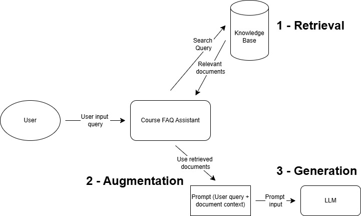

# LLM Zoomcamp 2026

This is the course summary page for the LLM Zoomcamp by [DataTalksClub](https://github.com/DataTalksClub) on GitHub. The course can be found [here](https://github.com/DataTalksClub/llm-zoomcamp)

## Index

| Lecture                     | Notes                                                                | Homework |
| --------------------------- | -------------------------------------------------------------------- | -------- |
| **Lecture 1 - Agentic RAG** | [1. Agentic Rag](#1-agentic-rag)                                     |
| 1.1 Introduction            | [1-1 Introduction](#1-1-introduction)                                |          |
| 1.2 Environment             | [1-2 Environment](#1-2-environment)                                  |          |
| 1.3 What is RAG             | [1-3 What is RAG (Retrieval-Augmented Generation)](#1-3-what-is-rag) |          |
| 1.4 The Course FAQ dataset  | [1-4 The Course FAQ Dataset](#1-4-the-course-faq-dataset)            |          |
| 1.5 Search                  |                                                                      |          |
| 1.6 Building Prompt         |                                                                      |          |
| 1.7 LLM                     |                                                                      |          |
| 1.8 RAG Helper              |                                                                      |          |
| 1.9 Data Ingestion          |                                                                      |          |
| 1.10 RAG Next Steps         |                                                                      |          |
| 1.11 Agents Intro           |                                                                      |          |
| 1.12 RAG Revision           |                                                                      |          |
| 1.13 Function Calling       |                                                                      |          |
| 1.14 Agentic Loop           |                                                                      |          |
| 1.15 Frameworks             |                                                                      |          |
| 1.16 Other Frameworks       |                                                                      |          |
| 2. Vector Search            | [2. Vector Search](#2-vector-search)                                 |          |
| 3. Orchestration            | [3. Orchestration](#3-orchestration)                                 |          |
| 4. Evaluation               | [4. Evaluation](#4-evaluation)                                       |          |
| 5. Monitoring               | [5. Monitoring](#5-monitoring)                                       |          |
| 6. Best Practices           | [6. Best Practices](#6-best-practices)                               |          |
| 7. End-to-End Project       | [7. End-to-End Project](#7-end-to-end-project)                       |          |
| Capstone Project            | [Capstone Project](#capstone-project)                                |          |

## 1. Agentic RAG

### 1-1 Introduction

- LLM is to predict the next words, given a set of words.
- LLMs are trained on vast volumes of data available across the Internet, and has millions and billions of parameters in its architecture
- In lecture 1, we treat LLMs as a black box and focus on integrating LLM providers for Retrieval-Augmented Generation (RAG) FAQ agent for the course

### 1-2 Environment

**Pre-requisites**

1. Python (3.14 or later)
2. OpenAI account
3. Python and CLI familiarity
4. `uv` package manager

Create a dedicated repository for the rest of the course (something like llm-zoomcamp-2026-code). When working through local system, clone your repo to your local system

**Step 1: Create the Project from scratch with `uv`**

Ensure you have the `uv` package manager installed - `pip install uv`

**Step 2: Create the project**

```bash
uv add requests minsearch openai jupyter python-dotenv
```

Library dependencies

1. `requests` - Fetch the dataset from the internet
2. `minsearch` - In-memory search engine for searching text
3. `openai` - OpenAI API client (Can use other OpenAI compatible APIs)
4. `jupyter` - Notebook env to write and run code
5. `python-dotenv` - Read env variables

**Step 3: Initialize the project, add the `pyproject.toml` and install the dependencies - `uv init`**

**Step 4: Create the file `notebook.ipynb`** - Notebook for the lesson

**Step 5: Create the `.gitignore`**

```
# .gitignore file

# Virtual Environment
.venv

# Environment variables
.env
```

**Step 6: Store the OpenAI API Key in `.env` in the repo root**

```
# .env file

OPENAI_API_KEY=<your-api-key>
```

> IMPORTANT: Do not share your OpenAI API key with anyone or commit it to your repo

**Step 7: Loading API key and creating OpenAI Client**

You can load the API Key with the help of `python-dotenv` in the notebook

```python
from dotenv import load_dotenv
load_dotenv()
```

Once the API Key is loaded, you can create the API client which will use the API Key to authenticate and connect to OpenAI models

```python
from openai import OpenAI
openai_client = OpenAI()
```

### 1-3 What is RAG

- RAG = Retrieval-Augmented Generation
- Most common application of LLMs
- RAG allows us to access information that the LLM is not aware of, and inject it into the inputs provided to the LLM which makes LLM responses more accurate and clear

We want to build a RAG system that can answer user queries based on information provided in the course FAQ

**Step 1: Define the function to send inputs and receive outputs from the LLM**

```python
def llm(prompt):
	response = openai_client.responses.create(
		model = 'gpt-5.4-nano', #Put your desired model name here, gpt-5.4-nano is the smallest and cheapest as of June 2026
		input = prompt
		)
	return response.output_text

question = 'I just discovered the course. Can I join now?'
answer = llm(question)
print(answer)
```

LLM response is generic, and may not reflect the actual results of joining the course late, or if the course is even open for late enrollment.

**Step 2: Add context information from course FAQ to the LLM prompt**

The information about the possibility of joining late can be found in the course FAQ, which we can use as the content to enhance the information available to the LLM to respond to the user query.

```python
context = 'your-context-here'
prompt = f'''Your task is to answer questions from the course participants based on the provided context.

Use the context to find relevant information and provide accurate answers.

Question:
{question}

Context:
{context}
'''

answer = llm(prompt)
print(answer)
```

This time, the answer is more specific since information from the FAQ is provided to the LLM as additional information to respond to the user's query. When provided this additional information, the LLM determines which parts of the information are relevant

**RAG Architecture**



Three steps of building a RAG FAQ:

1. **Retrieval** - search for relevant information
2. **Augmentation** - Augment user query with search results
3. **Generation** - Send user query + search results to LLM to generate response

### 1-4 The Course FAQ Dataset

The data about the available courses can be found in JSON format [here](https://datatalks.club/faq/json/courses.json). We first get the data about the available courses with the `requests` library

```python
import requests

docs_url = "https://datatalks.club/faq/json/courses.json"
response = requests.get(docs_url)
courses_raw = response.json()
```

`courses_raw` gives the data about courses which are available. Using this, we can get the FAQ data for the desired courses

```python
documents = []
url_prefix = "https://datatalks.club/faq"

for course in courses_raw:
    course_url = f"""{url_prefix}{course["path"]}"""

    course_response = requests.get(course_url)
    course_response.raise_for_status() # If something is broken, then raise an error
    course_data = course_response.json()

    documents.extend(course_data)

len(documents)
```

> Note: In real-world implementations, you will spend a lot of time ingesting and cleaning data which we need

## 2. Vector Search

Semantic search with embeddings, minsearch, sqlitesearch, and PGVector

## 3. Orchestration

AI orchestration with Kestra

## Workshop - Data Ingestion

Pull traces from a monitoring service for analytics with dlt

## 4. Evaluation

Measure retrieval and answer quality with offline and online eval

## 5. Monitoring

Monitor user feedback and system health with live dashboards

## 6. Best Practices

LangChain, hybrid search. Combine vector + keyword search; rerank results for higher precision

## 7. End-to-End Project

A complete project example: a fitness assistant built with LLMs

## Capstone Project

Ship a complete end-to-end project of your choice from scratch
